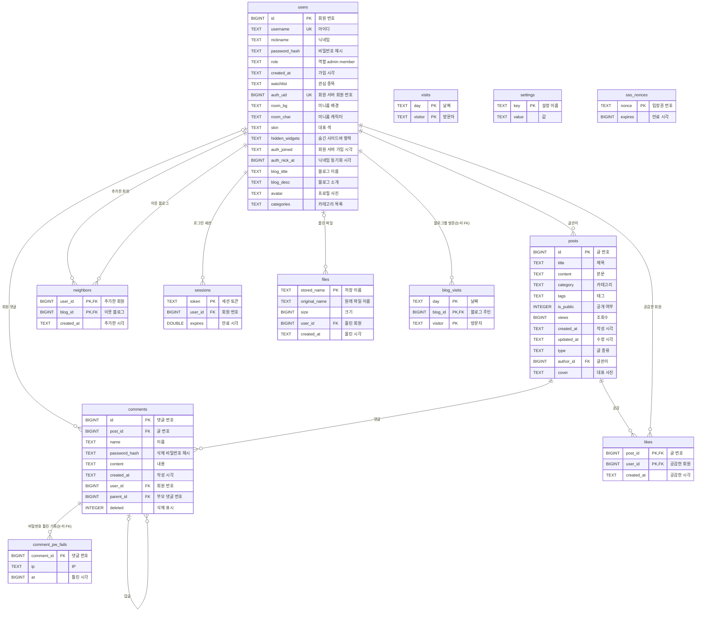
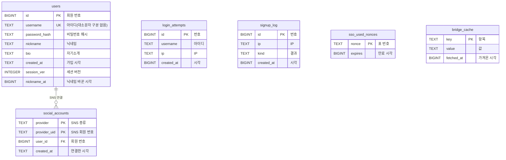

# ERD (데이터 구조)

블로그는 SQLite DB 두 개를 씁니다. 이 폴더에는 두 DB의 구조를 PostgreSQL 문법으로 옮긴 SQL과 관계도가 있습니다.

| 파일 | 실제 DB | 만드는 코드 | 테이블 |
|---|---|---|---|
| [`blog-db.sql`](blog-db.sql) | `blog.db` (블로그 서버) | `server.py`의 `init_db()` | 12개, 관계 12개 |
| [`member-db.sql`](member-db.sql) | `php-auth/db/sqlite.db` (회원 서버) | `php-auth/src/db.php`의 `db()` | 6개, 관계 1개 |

- 두 DB는 블로그 `users.auth_uid` → 회원 서버 `users.id`로 이어집니다(서로 다른 파일이라 FK 제약은 없음).
- 날짜·시각은 SQLite처럼 문자열 또는 epoch 초로 두었고, 정해진 값 목록(글 종류·대표 색 등)은 앱이 검사하므로 SQL의 `--` 설명에 적었습니다.
- **논리 FK**: `blog_visits.blog_id`, `comment_pw_fails.comment_id`는 실제 DB에 FK 제약이 없고 앱이 지킵니다(회원·댓글을 지울 때 함께 지우거나 15분 뒤 지움).
- 테이블·컬럼 이름과 순서는 실제 DB와 같습니다(2026-10-08에 두 DB를 새로 만들어 비교, PostgreSQL 16에서 두 SQL 실행 확인).

## Crowfoot 문서

[Crowfoot](https://crowfoot.java21.net/)(무료 온라인 ERD 툴)의 **나만의 블로그** 워크스페이스에 같은 내용의 문서가 있습니다.

| 문서 | 테이블 | 요구사항 · 그룹 | 배포한 DB |
|---|---|---|---|
| 나만의 블로그 — 블로그 DB (blog.db) | 12개, 관계 12개 | 13개(테이블 11 + 문서 전체 2) · 5개 | PostgreSQL #1 |
| 나만의 블로그 — 회원 DB (php-auth) | 6개, 관계 1개 | 6개 · 3개 | PostgreSQL #2 |

Crowfoot은 SQL을 가져올 때 FK 컬럼마다 인덱스를 더합니다(`idx_posts_author_id`, `idx_comments_post_id` 등 8개). 같은 이름의 인덱스 8개를 2026-10-08부터 블로그가 켤 때 실제 blog.db에도 만듭니다(`server.py`의 `FK_INDEXES`, 요구사항 NFR-18).

### 요구사항과 그룹

요구사항 제목 앞에 [requirements.md](../../requirements.md)의 ID를 붙였습니다(Crowfoot 번호 REQ-001…은 문서마다 따로 매김). 모든 테이블이 근거 요구사항에 연결돼 있고, 테이블 그룹은 요구사항의 도메인을 따릅니다. 업무 규칙은 Crowfoot의 각 요구사항 내용에 한 줄씩 적었습니다.

| 문서 | 그룹 | 요구사항 | 테이블 |
|---|---|---|---|
| 블로그 DB | 회원·블로그 | BLOG-02 회원마다 개인 블로그 | `users` |
| 블로그 DB | 회원·블로그 | AUTH-08·11 블로그 로그인 2주 유지 | `sessions` |
| 블로그 DB | 회원·블로그 | SEC-07 입장권 위조·재사용 막기 | `sso_nonces` |
| 블로그 DB | 글 | BLOG-05 마크다운 글쓰기 | `posts` |
| 블로그 DB | 글 | BLOG-06 사진과 파일 올리기 | `files` |
| 블로그 DB | 댓글·소통 | BLOG-08·SOC-01 댓글과 답글 | `comments` |
| 블로그 DB | 댓글·소통 | SEC-03 댓글 비밀번호 틀림 잠금 | `comment_pw_fails` |
| 블로그 DB | 댓글·소통 | SOC-02 공감 | `likes` |
| 블로그 DB | 댓글·소통 | SOC-03 이웃 | `neighbors` |
| 블로그 DB | 방문 통계 | BLOG-11 방문자 수 | `blog_visits`, `visits` |
| 블로그 DB | 사이트 설정 | BLOG-16 사이트 설정 | `settings` |
| 블로그 DB | (문서 전체) | NFR-08 데이터 보존(표·칸은 더하기만), NFR-18 연결 칸(FK) 인덱스 | — |
| 회원 DB | 회원 | AUTH-01·05 아이디·비밀번호 가입·로그인 | `users` |
| 회원 DB | 회원 | AUTH-06·07 SNS 가입·로그인·연결 | `social_accounts` |
| 회원 DB | 보안 | SEC-03 로그인 무차별 대입 막기 | `login_attempts` |
| 회원 DB | 보안 | SEC-14 자동·대량 가입 막기 | `signup_log` |
| 회원 DB | 보안 | AUTH-13 함께 로그아웃(1회용 표) | `sso_used_nonces` |
| 회원 DB | 연동 | AUTH-14 블로그의 회원가입 허용 따르기 | `bridge_cache` |

### PostgreSQL 배포 (2026-10-08)

- Crowfoot이 내어 주는 PostgreSQL DB 두 개(커넥션 'PostgreSQL #1'·'PostgreSQL #2')에 두 문서를 배포했습니다(블로그 DB 111문장·회원 DB 42문장, 실패 0). 빈 DB에 구조(표·관계·인덱스·설명)만 만들었고 자료는 넣지 않았습니다.
- **블로그는 계속 SQLite(`blog.db`, `php-auth/db/sqlite.db`)를 씁니다.** PostgreSQL DB는 설계를 실제 DB로 확인하고 Crowfoot에서 구조를 비교하는 데 씁니다.
- 접속 주소·계정·비밀번호는 Crowfoot의 데이터베이스 탭에서만 봅니다. 공개 저장소이므로 여기에 적지 않습니다.
- 배포 뒤 문서 → DB 비교(plan_migration): 블로그 DB는 차이 0. 회원 DB는 `users`·`social_accounts`의 `created_at` 기본값을 다시 설정하는 ALTER 2개가 나오지만, Crowfoot이 DB의 `to_char(…)` 기본값을 닫는 괄호 없이 읽어서 생기는 차이이고 실제 DB 기본값은 문서와 같습니다(같은 문장을 PostgreSQL 16에서 실행해 확인).
- DB → 문서 동기화(plan_sync·apply_sync)는 하지 않습니다. 위 기본값과 문자열 기본값(`'insight'` 같은 따옴표)을 문서와 다르게 읽어 문서를 망가뜨릴 수 있습니다.

### 구조를 바꿀 때

DB 구조를 바꾸면(`init_db()`·`db()`에 칸·표 추가) 이 폴더의 SQL과 아래 관계도, Crowfoot 문서를 함께 고칩니다. Crowfoot 문서는 PostgreSQL DB에 연결돼 있으므로 새 문서를 만들지 않고 기존 문서를 고친 뒤, plan_migration으로 바뀌는 ALTER 문을 확인하고 apply_migration으로 PostgreSQL에도 반영합니다(칸·표는 더하기만, NFR-08). 새 테이블은 근거 요구사항에 연결해 그룹을 채웁니다.

처음부터 새 시안을 만들 때만: 워크스페이스 ERD 탭 → **SQL 가져오기** → 데이터베이스 종류 **PostgreSQL** → SQL 파일 내용을 붙여 넣고 미리보기(테이블·관계 수 확인) → 다른 이름으로 문서 만들기.

## 블로그 DB 관계도

## 회원 DB 관계도

