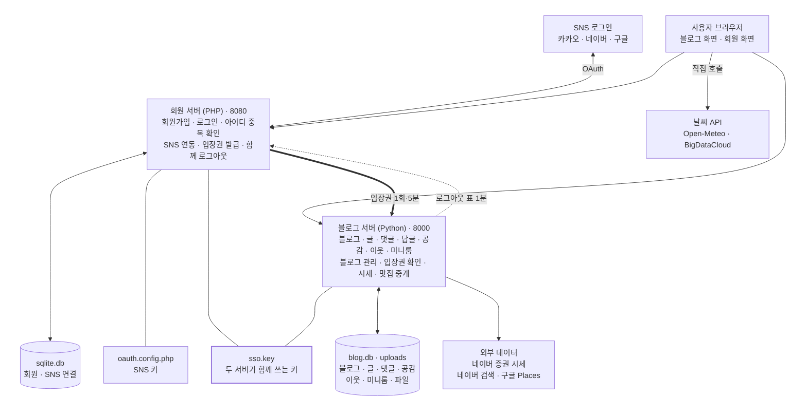

# 나만의 블로그 요구사항 정의서

2026-10-02 · 박창근

> 이 파일은 Claude Docs 문서 [나만의 블로그 요구사항 정의서](https://claude.ai/artifact/RwM5NYppuiRaTd2v61Phud)를 2026-10-07에 옮긴 사본입니다. 문서를 고치면 이 파일도 함께 맞춰 주세요.

## 1. 개요

'나만의 블로그'는 회원마다 자기 블로그를 갖는 네이버 블로그형 서비스입니다. 회원가입·로그인은 PHP 회원 서버가, 글·블로그는 Python 블로그 서버가 맡습니다. 이 문서는 지금까지 만든 기능을 요구사항으로 정리한 것입니다.

**범위:** 회원·인증(아이디·SNS 로그인), 개인 블로그와 글, 블로그 관리, 미니룸, 답글·공감·이웃, 날씨·주식·맛집 부가 기능, 보안. 인터넷 공개(배포)는 범위 밖입니다.

| 사용자 | 할 수 있는 일 |
| --- | --- |
| 방문자 | 블로그 홈·개인 블로그(미니룸·이웃 수·공감 수 포함) 읽기, 검색, 이름·비밀번호로 댓글·답글(같은 비밀번호로 삭제), 날씨·주식 보기, 관심 종목 편집(이 브라우저에만 저장) |
| 회원 | 위 + 아이디·비밀번호 또는 SNS(카카오·네이버·구글 중 키를 등록한 것)로 가입·로그인, 내 블로그 운영(글쓰기·사진·파일 올리기·관리), 닉네임으로 댓글·답글, 공감(♥), 이웃 추가·취소와 이웃 새 글 보기, 관심 종목 계정에 저장, 맛집 검색 |
| 블로그 주인 | 내 글에 달린 댓글·답글 삭제, 카테고리·블로그 정보·미니룸(배경·캐릭터) 관리, 방문 통계·받은 공감·나를 이웃한 사람 수 확인 |
| 관리자(admin) | 블로그 자체 로그인(아이디 admin), 모든 글(비공개 포함) 보기·수정·삭제, 모든 댓글·답글 삭제, 회원 탈퇴 처리(블로그 계정·글·댓글·공감·이웃과 회원 서버 계정·SNS 연결 삭제), 회원가입 허용(끄면 블로그의 가입 버튼 숨김·새 블로그 생성 거절·회원 서버 가입도 거절), 사이트 이름·소개·기본 관심 종목·맛집 API 키 등록(SNS 로그인 키는 php-auth/oauth.config.php 파일에 직접) |

| 구성 요소 | 기술 | 주소 | 데이터 |
| --- | --- | --- | --- |
| 블로그 서버 | Python 3 표준 라이브러리, 바닐라 JS + CDN(marked·DOMPurify·highlight.js·Pretendard 글꼴) | localhost:8000 | blog.db (SQLite: 블로그·글·댓글·답글·공감·이웃·미니룸·방문 기록), uploads/ (사진·첨부 파일) |
| 회원 서버 | PHP 8 + PDO(SQLite), curl(SNS 로그인) | localhost:8080 | php-auth/db/sqlite.db (SQLite: 회원·SNS 연결·로그인 실패 기록), php-auth/oauth.config.php (SNS 로그인 키) |
| 연결 | HMAC-SHA256 서명: 입장권(회원 서버 → 블로그, 5분·1회), 로그아웃 표(블로그 → 회원 서버, 1분) | — | php-auth/db/sso.key (공유 키, 처음 필요할 때 자동 생성) |

*시스템 구성: 회원 서버가 로그인을 맡고, 서명된 입장권으로 블로그에 넘긴다 (서버 2개, 데이터 파일 4개, 외부 서비스 3곳).*

회원 로그인은 회원 서버에서 하고(관리자·예전 블로그 계정만 블로그 자체 로그인), 블로그 서버는 두 서버가 함께 쓰는 sso.key로 입장권의 서명을 확인합니다. 블로그에서 로그아웃하면 같은 키로 서명한 1분짜리 표로 회원 서버도 함께 로그아웃됩니다.

## 2. 회원·인증 요구사항

회원 계정은 PHP 회원 서버 한 곳에서만 만들고, 블로그는 그 계정으로 로그인합니다.

| ID | 요구사항 | 완료 기준 |
| --- | --- | --- |
| AUTH-01 | 가입 항목은 아이디·비밀번호·닉네임·자기소개 4가지로 제한한다 | 아이디 영문 소문자·숫자·\_ 4\~20자(대문자는 소문자로 바꿔 저장), 비밀번호 영문+숫자 8자 이상·72바이트 이하, 닉네임 2\~20자, 자기소개 선택 300자 이하 |
| AUTH-02 | 아이디 중복 확인을 통과한 아이디로만 가입된다 | 확인 후 아이디를 바꾸면 다시 확인, 서버도 확인된 아이디인지 검사, 동시 가입은 DB UNIQUE로 한 명만 |
| AUTH-03 | 중복 확인 결과를 바로 보여 준다 | 사용 가능 초록, 사용 중·예약어(admin·administrator·root·manage·settings·login·signup·write·system)·형식 오류 빨간색, 같은 브라우저(세션)에서 5분에 30번까지 |
| AUTH-04 | 비밀번호 확인이 다르면 입력 즉시 빨간색으로 표시한다 | 칸 테두리·안내문 빨간색, 일치하면 초록색, 서버도 불일치 거절 |
| AUTH-05 | 아이디·비밀번호로 로그인한다 | 실패 문구는 아이디 존재 여부를 드러내지 않음, 아이디 대소문자 구분 없음 |
| AUTH-06 | 카카오·네이버·구글 SNS로 가입·로그인한다 | 키를 등록한 SNS만 버튼 표시(로그인·회원가입 화면), 처음이면 아이디(중복 확인)·닉네임(SNS 이름 미리 채움)·자기소개만 받고 비밀번호 없이 가입, SNS 인증 후 15분 안에 가입을 마쳐야 함, SNS로만 가입한 회원은 회원 페이지 내 정보 수정에서 비밀번호를 만들기 전까지 비밀번호 로그인 불가 |
| AUTH-07 | 기존 회원은 내 정보에서 SNS 계정을 연결한다 | SNS 회원 번호로만 연결, 이메일 자동 병합 없음, 다른 회원에 연결된 SNS 계정은 거절, SNS 종류마다 계정 1개만 연결, 연결 해제 기능 없음, 네이버는 연결할 때 다시 로그인 |
| AUTH-08 | 회원 로그인 후 블로그로 돌아가 로그인 상태가 된다 | PHP가 서명한 1회용 5분 입장권을 블로그가 확인, 처음이면 블로그 자동 생성(이름 "닉네임의 블로그", 자기소개 앞 200자 → 블로그 소개, 기본 카테고리 3개) 후 블로그 관리 → 블로그 정보로 이동, 아니면 로그인이 필요했던 화면(없으면 블로그 홈)으로 이동 |
| AUTH-09 | PHP에 이미 로그인돼 있어도 버튼을 눌러야 블로그에 들어간다 | "○○님으로 블로그 들어가기" / "다른 계정으로 로그인" 선택 |
| AUTH-10 | 같은 아이디의 예전 블로그 계정은 예전 비밀번호로만 연결한다 | 틀리면 연결 거절(0.5초 지연, 횟수 제한 없음), admin이나 이미 다른 회원과 연결된 블로그 아이디는 연결 불가, 한 번 연결하면 다음부터 바로 로그인 |
| AUTH-11 | 관리자와 아직 회원 계정과 연결하지 않은 예전 블로그 계정은 블로그 자체 로그인을 쓴다 | 로그인 화면의 접힌 "관리자 · 예전 블로그 계정으로 로그인" 폼, 관리자 아이디 admin, 비밀번호는 서버를 켤 때마다 BLOG\_PASSWORD로 다시 설정(지정 안 하면 admin1234), PHP 회원과 연결된 계정은 사용 불가, 틀리면 0.5초 지연(잠금 없음) |
| AUTH-12 | 모든 회원 화면에서 블로그 홈으로 돌아갈 수 있다 | 회원 페이지 모든 화면(로그인·회원가입·SNS 가입·내 정보·블로그로 계속하기) 맨 위와 블로그 로그인 화면(#/login)에 "← 블로그 홈으로" |
| AUTH-13 | 블로그에서 로그아웃하면 회원 페이지(PHP)도 함께 로그아웃되고, 로그아웃은 위조할 수 없다 | 블로그가 sso.key로 서명하고 회원 번호를 넣은 1분짜리 1회용 표를 POST 폼으로 보내 PHP도 로그아웃 후 블로그 홈으로 복귀(회원 페이지와 연결된 계정만, 관리자·예전 블로그 계정은 블로그만), 회원 서버가 1.5초 안에 응답하지 않으면 블로그만 로그아웃, 위조·만료 표, 다른 회원의 표, 이미 쓴 표, 링크 클릭(GET)으로는 로그아웃되지 않음, 회원 페이지(PHP)에서 로그아웃하면 회원 페이지만 로그아웃(블로그 로그인 유지) |
| AUTH-14 | 관리자가 회원가입 허용을 끄면 새 블로그를 만들 수 없다 | 블로그의 회원가입 버튼(상단·블로그 홈 소개·사이드바·로그인 화면) 모두 숨김, 처음 들어오는 회원은 "지금은 새 블로그를 만들 수 없어요"로 거절, 회원 페이지(PHP)의 일반 가입·SNS 첫 가입·아이디 중복 확인도 "지금은 새 가입을 받지 않아요"로 거절(회원 서버는 블로그가 서명한 값을 1분 동안 기억, 블로그에 물을 수 없으면 마지막 값·한 번도 못 받았으면 닫힘), 기존 회원 로그인은 그대로 |
| AUTH-15 | 블로그 내 정보에서 닉네임과 비밀번호를 바꾼다 | 내 메뉴 → 내 정보, 아이디는 보기만, 닉네임 2\~20자, 비밀번호는 연결 안 한 예전 블로그 계정만(현재 비밀번호 확인, 새 비밀번호 8자 이상), 회원 계정은 "회원 페이지 내 정보 수정" 링크 안내(회원 페이지에서 바꾼 닉네임은 다음 블로그 입장 때 반영, 블로그에서 바꾼 닉네임은 블로그에만), 관리자 비밀번호는 BLOG\_PASSWORD로만 |
| AUTH-16 | 회원 페이지(PHP) 내 정보에서 내 계정을 확인하고 고친다 | 닉네임·@아이디·가입일·자기소개 표시, SNS별 연결 상태와 "연결하기", SNS로만 가입한 회원은 "SNS로만 로그인" 안내, "내 블로그로 가기" 버튼, 로그아웃은 버튼(POST)으로만, "내 정보 수정"(profile.php)에서 닉네임·자기소개 저장, 비밀번호 바꾸기(현재 비밀번호 확인·15분 5번 잠금, 바꾸면 다른 브라우저의 회원 페이지 로그인 끊김) 또는 SNS 전용 회원의 첫 비밀번호 만들기, 회원 탈퇴(비밀번호, SNS 전용은 아이디 입력으로 확인 → 블로그 계정을 먼저 지우고 성공해야 회원 계정 삭제, 블로그가 꺼져 있으면 탈퇴하지 않음) |
|  |  |  |

## 3. 블로그 기능 요구사항

회원마다 `#/@아이디` 주소의 블로그를 갖고, 블로그 홈에는 모든 블로그의 새 글이 모입니다.

| `ID` | `요구사항` | `완료 기준` |
| --- | --- | --- |
| `BLOG-01` | `블로그 홈에 모든 블로그의 공개 글을 최신순으로 보여 준다` | `사이트 소개(로그인 시 '내 블로그로 가기', 비로그인은 회원가입 허용 시 '가입하고 내 블로그 만들기' 버튼)·블로그 둘러보기(공개 글이 있는 블로그만 최근 글 순 12개)는 첫 페이지에만, 카드 목록(본문 첫 사진 썸네일·종류·카테고리·요약 160자·블로그·날짜·댓글·조회, 공감은 1개 이상일 때), 페이지 나눔(8개), 사이드바(내 블로그 바로가기·인기 태그 30개·최근 댓글 5개·사이트 전체 방문자 오늘/어제/전체), 로그인하면 내 비공개 글도 '비공개' 표시로 함께 보임(관리자는 모든 비공개 글)` |
| `BLOG-02` | `회원마다 개인 블로그를 갖는다` | `배너: 미니룸(BLOG-17)·프로필 사진·블로그 이름·닉네임·글 수·이웃 수·소개, 사이드바: 프로필·카테고리(전체보기·미분류 포함, 글 수)·글 종류·태그 30개·최근 댓글 5개·방문자(오늘/어제/전체, 같은 방문자 하루 1번, 주인 본인 방문은 안 셈), 남의 블로그는 이웃 추가/취소 버튼(SOC-03), 내 블로그는 글쓰기·관리·미니룸 꾸미기·카테고리 편집 바로가기` |
| `BLOG-03` | `글 종류는 인사이트·자주 묻는 질문·용어 사전·일상 4``가``지다` | `FAQ는 질문을 누르면 답변 펼침, 용어 사전은 ㄱㄴㄷ·ABC 색인과 가나다순 카드, 두 종류는 8개씩 나누지 않고 한 페이지에 200개까지` |
| `BLOG-04` | `카테고리는 블로그마다 따로 있다` | `새 블로그 기본값 마케팅·AI/기술·데이터, 이름 20자·최대 30개, 일상 글이나 카테고리가 하나도 없는 블로그의 글은 카테고리 없이 가능, 없는 카테고리로는 글쓰기 거절` |
| `BLOG-05` | `마크다운 편집기로 글을 쓴다` | `도구 모음(제목 H2·H3·굵게·기울임·취소선·코드·인용·목록·링크·코드 블록·구분선·사진·파일), Ctrl·Cmd+B·I 단축키, 실시간 미리보기(작성/나란히/미리보기 전환, 코드 색 표시), 새 글만 이 브라우저에 자동 임시 저장(다시 열면 불러올지 물음), 제목 200자, 태그 쉼표로 구분해 20개까지, 공개/비공개, 글 종류에 맞는 안내 문구` |
| `BLOG-06` | `사진과 파일을 올린다` | `사진 PNG·JPG·GIF·WEBP 10MB, 파일 PDF·한글·워드·엑셀·파워포인트·키노트·ZIP·TXT·CSV·MD·JSON·MP3·MP4 30MB, 버튼·붙여넣기·드래그로 여러 개 한 번에, 파일은 본문에 파일 카드(아이콘·이름·크기)로 보이고 원래 이름으로 내려받기` |
| `BLOG-07` | `내 글만 수정·삭제한다` | `비공개 글은 글쓴이와 관리자만 보기('비공개' 표시), 관리자는 모든 글 수정·삭제 가능, 글을 지우면 댓글·공감도 함께 삭제` |
| `BLOG-08` | `글에 댓글을 단다` | `회원은 닉네임으로('회원' 표시), 방문자는 이름(30자)+비밀번호로, 내용 2000자까지, 답글 1단계(SOC-01), 삭제는 작성자(방문자는 비밀번호 입력, 비밀번호는 주소가 아니라 본문으로 전송)·블로그 주인·관리자만, 답글이 달린 댓글을 지우면 '삭제된 댓글입니다'로 남음` |
| `BLOG-09` | `글 상세 화면` | `조회수(같은 브라우저 24시간에 1번, 글쓴이·관리자가 볼 때는 안 셈), 공감 버튼(♡/♥와 공감 수, SOC-02), 태그, 작은 블로그 배너(남의 블로그면 이웃 추가 버튼)와 블로그 소개 카드, 같은 블로그·종류 안의 이전/다음 글, 같은 블로그·종류·카테고리의 다른 글 5개, 글을 읽으면 그 블로그 방문자로 셈` |
| `BLOG-10` | `검색한다` | `블로그 홈에서는 전체, 개인 블로그 안에서는 그 블로그 글만, 제목·본문 대상` |
| `BLOG-11` | `블로그 관리 — 홈` | `오늘·어제·전체 방문, 글 수(공개 글 수 함께 표시), 받은 댓글, 전체 조회수, 받은 공감, 나를 이웃한 사람 수, 최근 7일 방문자 막대, 많이 본 글 5개 (내 방문은 제외)` |
| `BLOG-12` | `블로그 관리 — 글` | `내 글 목록(한 페이지 20개, 제목·댓글 수·종류·카테고리·공개 상태·날짜·조회·수정 버튼)·검색, 전체 선택, 지금 페이지에서 여러 개를 골라 한 번에 공개/비공개/삭제(삭제하면 댓글·공감도 함께, 남의 글은 바뀌지 않음)` |
| `BLOG-13` | `블로그 관리 — 댓글` | `내 글에 달린 댓글·답글을 최신순으로 모아 보고(한 페이지 20개, 회원 표시, 어느 글인지 링크) 삭제` |
| `BLOG-14` | `블로그 관리 — 카테고리` | `추가(이름 20자, 같은 이름 불가)·이름 바꾸기(글도 함께 이동)·↑↓ 순서·삭제(글은 미분류로, 글이 있으면 한 번 더 확인)·카테고리별 글 수와 미분류 글 수 표시` |
| `BLOG-15` | `블로그 관리 — 블로그 정보` | `블로그 이름 1~40자, 소개 200자, 닉네임 2~20자, 프로필 사진 바꾸기·지우기(PNG·JPG·GIF·WEBP, 없으면 닉네임 첫 글자), 블로그 주소 안내, 블로그가 처음 생기면 이 화면으로 바로 이동` |
| `BLOG-16` | `사이트 설정 (관리자)` | `사이트 이름·소개(300자), 회원가입 허용(끄면 블로그의 회원가입 버튼을 숨기고 새 블로그 생성 거절, 회원 서버 가입도 거절), 기본 관심 종목(6자리 코드 12개까지), 맛집 API 키(등록 여부만 표시, - 입력 시 삭제), 회원 목록(닉네임·아이디·글 수·가입일)·탈퇴(블로그·글·댓글·공감·이웃·방문 기록 함께 삭제, 탈퇴 회원의 댓글에 다른 사람의 답글이 있으면 '삭제된 댓글입니다'로 남기고 답글은 유지, 관리자는 탈퇴 불가, 회원 서버 계정·SNS 연결도 서명된 1회용 요청으로 먼저 지우고 성공해야 블로그를 지움(회원 서버가 꺼져 있으면 탈퇴하지 않음), 다른 곳에서 안 쓰는 올린 파일은 삭제)` |
| `BLOG-18` | `상단 메뉴로 어디서나 이동한다` | `위쪽 줄: 사이트 이름·검색(개인 블로그 안에서는 '이 블로그 검색')·화면 모드, 메뉴: 블로그 홈·인사이트·자주 묻는 질문·용어 사전·일상(모든 블로그의 그 종류 글 모아 보기)·이웃 새 글(로그인 시)·맛집, 태그를 누르면 태그 글 목록` |
| `BLOG-19` | `오른쪽 위에 글쓰기 버튼과 내 메뉴를 둔다` | `로그인 시 글쓰기 + 프로필 사진·닉네임 메뉴(내 블로그·이웃 새 글·블로그 관리·내 정보·사이트 설정(관리자만)·로그아웃), 메뉴 밖이나 메뉴 항목을 누르면 닫힘, 로그인 안 했으면 로그인·회원가입(회원가입 허용 시) 버튼` |

## 4. 부가 기능 요구사항

사이드바 맨 위 위젯과 맛집 페이지는 모든 화면에서 쓸 수 있습니다.

| ID | 요구사항 | 완료 기준 |
| --- | --- | --- |
| EXT-01 | 오늘 날짜와 시간을 보여 준다 | "2026년 10월 2일 금 / 오전 10:07:07" 형식, 1초마다 갱신 |
| EXT-02 | 내 위치의 현재 날씨와 7일 예보를 보여 준다 | 현재 기온·체감 온도·날씨, 7일 최저/최고 기온, 비 올 확률은 30% 이상일 때만 표시, 브라우저 위치 허용 시 내 지역(지역 이름은 BigDataCloud), 거부 시 서울 + "내 위치로" 버튼(그래도 꺼져 있으면 허용 방법 안내), 좌표는 소수 둘째 자리(약 1km)로 줄여 브라우저가 Open-Meteo·BigDataCloud에 직접 전송, 내 위치 결과만 브라우저에 30분 저장(서울은 저장 안 함), 켜 둔 화면은 30분마다 새로 가져옴 |
| EXT-03 | 코스피·코스닥 지수와 관심 종목 시세를 보여 준다 | 장중 5초, 장 마감 후 1분마다 갱신, 머리글에 '실시간'/'장 마감'과 마지막 거래 시각, 상승 빨간색 ▲·하락 파란색 ▼, 바뀐 가격은 1초 반짝임(동작 줄이기 설정이면 끔), 탭을 안 볼 때는 멈추고 돌아오면 바로 갱신, 시세를 못 받으면 직전 값 유지(처음부터 못 받은 종목은 '불러오지 못함'), 블로그 서버 요청이 실패하면 15초 뒤 다시 시도, 출처와 '투자 판단의 근거로 쓰지 마세요' 표시 |
| EXT-04 | 관심 종목을 추가·삭제한다 | 이름·코드로 검색해 추가(국내 종목만, 결과 최대 8개, Enter는 첫 결과 추가, 이미 담은 종목은 '추가됨'), 편집에서 ✕로 삭제, 최대 12개(서버도 6자리 코드만·중복 없이 12개까지 저장), 담은 순서대로 보이고 코스피·코스닥은 항상 맨 위(삭제 불가), 회원은 계정에·방문자는 브라우저에 저장, 로그인하면 계정 목록으로 바뀜(브라우저 목록은 옮겨지지 않음), 처음에는 관리자의 기본 목록(기본값 삼성전자·SK하이닉스) |
| EXT-05 | 식당을 검색해 평점·방문자 리뷰·블로그 후기를 본다 | 네이버 검색 API(장소 5곳, 블로그 후기 10개는 '주소의 구(없으면 군·시·동 등) + 식당 이름 + 후기'로 검색) + 구글 Places API(평점·리뷰 수·리뷰 5개), 네이버 키가 없으면 장소 검색도 구글로 5곳, 식당을 누르면 평점·후기 펼침(결과가 1곳이면 바로 펼침), 회원 전용(서버도 거절), 검색어 50자까지, 같은 검색 10분 서버 캐시, 키 오류·하루 사용량 초과는 한국어로 안내, 네이버·카카오·구글 지도 링크는 키 없이도 동작 |
| EXT-06 | 화면 모드를 고른다 | 시스템 → 라이트 → 다크 순서 버튼(아이콘으로 현재 모드 표시, 바꾸면 안내 문구), 브라우저에 저장, 첫 화면부터 깜빡임 없이 적용, 코드 블록 색도 함께 바뀜, 회원 페이지(로그인·회원가입·SNS 가입·내 정보)는 이 버튼과 관계없이 기기 설정을 따름 |

## 5. 보안 요구사항

모든 보안 항목은 화면이 아니라 서버에서 강제합니다. 화면 검사는 빠른 안내용입니다.

| ID | 요구사항 | 완료 기준 |
| --- | --- | --- |
| SEC-01 | SQL 인젝션을 막는다 | 모든 쿼리는 자리표시자(?) 바인딩, PHP는 PDO prepare + ATTR\_EMULATE\_PREPARES=false, `' OR '1'='1` 등으로 로그인·가입 불가 |
| SEC-02 | 비밀번호는 해시로만 저장한다 | PHP bcrypt(password\_hash, 72바이트까지, 더 강한 방식이 나오면 로그인 때 자동 교체), 블로그 관리자·예전 블로그 계정·방문자 댓글 비밀번호는 PBKDF2-SHA256 10만 회 + 무작위 솔트, 원문 저장 없음 |
| SEC-03 | 비밀번호 무차별 대입을 막는다 | PHP 회원 로그인: 같은 아이디·IP로 15분 안에 5번 틀리면 잠금(첫 실패 15분 뒤 풀림), 성공하면 실패 기록 삭제 / 블로그 자체 로그인(admin·예전 계정)·예전 블로그 연결: 틀릴 때마다 0.5초 지연만, 잠금 없음 / 방문자 댓글 삭제 비밀번호: 틀릴 때마다 0.5초 지연, 같은 댓글에 같은 IP로 15분 안에 5번(IP와 관계없이 20번) 틀리면 첫 실패 15분 뒤까지 잠금(서버를 다시 켜도 유지), 블로그 주인·관리자 삭제는 잠금과 무관 |
| SEC-04 | XSS(스크립트 끼워 넣기)를 막는다 | PHP는 htmlspecialchars, 블로그는 모든 출력 이스케이프 + 본문 DOMPurify |
| SEC-05 | CSRF(다른 사이트에서 몰래 보내는 요청)를 막는다 | PHP 모든 폼(로그인·가입·SNS 가입·로그아웃·블로그 들어가기)과 중복 확인에 세션마다 발급하는 CSRF 토큰 확인, PHP 로그아웃은 POST만, PHP 세션 쿠키 SameSite=Lax, 블로그 세션 쿠키 SameSite=Strict |
| SEC-06 | 세션을 보호한다 | HttpOnly 쿠키, 로그인 시 세션 번호 재발급, PHP 로그인은 브라우저를 닫으면 끝, 블로그 로그인 2주 유지(DB 저장, 로그아웃·회원 탈퇴 시 DB에서 삭제) |
| SEC-07 | 블로그 입장권을 위조·재사용할 수 없다 | HMAC-SHA256 서명, 5분 만료, 1회용(nonce 기록), 주소의 # 뒤에 실어 서버 기록에 남지 않고 받자마자 주소창·방문 기록에서 지움, 블로그가 아이디 형식 다시 검사, 블로그 주소로만 돌려보냄 |
| SEC-08 | SNS 로그인 위조를 막는다 | state 값 확인(1회·10분), 구글은 PKCE(S256), SNS 시작 안 한 브라우저의 콜백 거절, 네이버 계정 연결 시 다시 로그인 요구, SNS 첫 가입은 15분 안에 마쳐야 함 |
| SEC-09 | 다른 사람의 계정·블로그를 가로챌 수 없다 | 계정 연결은 회원 번호로만, admin 등 예약 아이디 가입 불가, SNS 전용 회원은 비밀번호 로그인 불가 |
| SEC-10 | 비밀 정보를 보관한다 | DB·키 파일은 웹 폴더(public·static) 밖, sso.key는 처음 필요할 때 무작위로 만들고 주인만 읽고 쓸 수 있게(권한 600), SNS 키는 oauth.config.php에만, 맛집 API 키는 화면에 다시 보이지 않음(등록 여부만 표시), 공개 블로그 정보에 계정 연결 번호 미노출 |
| SEC-11 | 업로드 파일로 공격할 수 없다 | 허용 목록 형식만 받음(사진 PNG·JPG·GIF·WEBP, 파일 PDF·한글·오피스·키노트·ZIP·TXT·CSV·MD·JSON·MP3·MP4), HTML·SVG·JS·EXE 등 거부, 저장 이름은 무작위 32자리(원래 이름은 DB에만), 모든 업로드 파일에 nosniff, 사진 외 파일은 항상 내려받기(attachment), 로그인한 회원만 업로드, 프로필 사진은 업로드 사진 주소 형식(/uploads/…)만 저장, 비공개 글의 사진·파일도 주소를 알면 로그인 없이 열림 |
| SEC-12 | 권한은 화면이 아니라 서버가 확인한다 | 글 수정·삭제는 글쓴이·관리자만, 블로그 관리 일괄 변경은 내 글만, 비공개 글은 글쓴이·관리자 외에는 목록·상세·댓글·공감 모두 막음, 공감·이웃·관심 종목 저장·맛집·업로드는 로그인 회원만, 답글은 같은 글의 댓글에만 1단계, 답글이 달린 댓글을 지우면 자리만 남기고 내용·이름·비밀번호는 비움, 미니룸은 허용 목록 값만 저장 |

## 6. 비기능 요구사항

| ID | 요구사항 | 완료 기준 |
| --- | --- | --- |
| NFR-01 | 네오 브루탈리즘 카드 디자인 | PC(901px 이상)는 3px 테두리 + 6px 그림자, 마우스를 올리면 떠오름(그림자 9px)·누르면 눌림, 900px 이하는 1px 테두리·그림자 없음, 회원 화면(PHP)은 휴대폰에서도 3px 테두리 + 그림자(480px 이하 4px) |
| NFR-02 | 한국어 글꼴 | Pretendard(jsdelivr CDN에서 불러옴, 못 불러오면 Apple SD Gothic Neo 등 기기 한글 글꼴), 블로그·회원 화면 공통, 코드는 고정폭 글꼴 |
| NFR-03 | 반응형 | 375px 휴대폰에서 가로 넘침 없음, 900px 이하에서 사이드바는 본문 아래로·편집기 미리보기는 편집 칸 아래로·글 카드 1열(PC 2열), 600px 이하는 양옆 여백 16px·로그인 상태면 상단 검색창 숨김 |
| NFR-04 | 다크 모드 | 블로그의 모든 화면·코드 색·위젯이 고른 모드에 맞게 바뀜, 미니룸 그림은 모드와 관계없이 같은 색, 회원 화면(PHP)은 블로그에서 고른 모드가 아니라 기기 설정(라이트/다크)만 따름 |
| NFR-05 | 외부 서비스 부담 줄이기 | 시세 4초 서버 캐시(방문자 여럿이 같은 시세를 나눠 씀, 실패하면 직전 시세 유지), 맛집은 같은 검색 10분 서버 캐시(최대 500건), 서버의 외부 요청은 8초 제한, 날씨는 서버를 거치지 않고 브라우저가 직접 받아 브라우저에 30분 저장(내 위치를 허용한 경우만) |
| NFR-06 | 화면 파일은 항상 최신 | Cache-Control: no-cache + 버전 표시(?v=), 업로드 파일은 1년 캐시 |
| NFR-07 | 실행 환경 | Python 3.9 표준 라이브러리만, PHP 8(pdo\_sqlite·mbstring, SNS 로그인은 curl), 서버에 따로 설치할 패키지 없음, 화면의 글꼴·마크다운·코드 색 라이브러리(marked·DOMPurify·highlight.js)는 jsdelivr CDN에서 불러와 인터넷 연결 필요 |
| NFR-08 | 데이터 보존 | 서버를 다시 켜도 글·댓글·로그인(블로그 2주) 유지, 기능이 늘어도 예전 blog.db에 필요한 칸만 자동 추가(기존 글 유지), 처음 실행하면 관리자 블로그에 예시 글 7개(인사이트 1·FAQ 2·용어 사전 3·일상 1) 자동 생성, 백업은 blog.db·uploads/·php-auth/db/·php-auth/oauth.config.php(SNS 키) 복사 |
| NFR-09 | 알기 쉬운 오류 안내 | 화면 오류 문구는 한국어(예상 못 한 서버 오류는 '서버 오류:' 뒤에 원문, 켜 둔 화면에서 서버가 꺼지면 브라우저 기본 문구), 블로그가 이미 켜져 있으면 "이미 실행 중"과 끄는 방법(Ctrl + C)만 안내하고 DB는 건드리지 않음, 관리자 비밀번호가 기본값이면 켤 때 BLOG\_PASSWORD로 바꾸라는 안내 |
| NFR-10 | 접근성(움직임 줄이기·키보드·화면 읽기) | 기기에서 '동작 줄이기'를 켜면 카드 떠오름·시세 반짝임·미니룸 캐릭터 움직임 끔, 키보드로 이동하면 카드(PC)·공감·이웃·미니룸 선택 버튼 등에 강조색 3px 포커스 테두리, 미니룸 그림·방문자 막대·별점·화면 모드 버튼 등에 화면 읽기용 이름 |
| NFR-11 | 미니룸 그림은 외부 이미지 없이 | 배경 6·캐릭터 6 모두 코드 안에 직접 그린 SVG, 외부 이미지 파일·주소 없음, 화면 폭에 맞춰 늘어남(배너 높이는 최대 220px) |
| NFR-12 | 접속 범위와 주소 설정 | 블로그는 기본적으로 이 컴퓨터에서만 접속(127.0.0.1:8000), HOST=0.0.0.0으로 켜면 같은 와이파이 기기에서 '이 컴퓨터 IP:8000'으로 접속, 포트·주소는 PORT·AUTH\_URL(블로그 서버)·BLOG\_URL(회원 서버) 환경변수로 변경, 다른 기기에서 회원 로그인까지 하려면 AUTH\_URL·BLOG\_URL과 회원 서버 주소도 IP로 바꿔야 함 |

## 7. 외부 연동과 남은 과제

SNS 로그인은 네이버만 키를 등록했고, 실제 네이버 계정으로 가입해 블로그 로그인까지 확인했습니다. 카카오·구글 로그인 키와 맛집 검색(네이버 검색 API·구글 Places) 키는 아직 등록하지 않았습니다.

| 외부 서비스 | 쓰는 곳 | 키 | 현재 |
| --- | --- | --- | --- |
| 네이버 로그인 | AUTH-06 | Client ID·Secret | 등록됨, 실제 네이버 계정으로 가입·블로그 로그인 확인(10월 2일, 연결 1개) |
| 카카오 로그인 | AUTH-06 | REST API 키 | 미등록 |
| 구글 로그인 | AUTH-06 | OAuth 클라이언트 ID·보안 비밀번호 | 미등록 |
| 네이버 검색 API | EXT-05 | Client ID·Secret | 미등록 |
| 구글 Places API | EXT-05 | API 키 (결제 카드 등록 필요) | 미등록 |
| Open-Meteo · BigDataCloud | EXT-02 | 필요 없음 | 동작 중 |
| 네이버 증권 실시간 시세 | EXT-03·04 | 필요 없음 (비공식 데이터) | 동작 중 |
| jsDelivr CDN (marked·DOMPurify·highlight.js·Pretendard 글꼴) | BLOG-05·SEC-04·NFR-02·NFR-04 | 필요 없음 | 동작 중, 인터넷이 끊기거나 CDN이 막히면 글 목록·본문이 나오지 않음 |

SNS 로그인 키는 php-auth/oauth.config.php 파일에, 맛집 키(네이버 검색 API·구글 Places)는 블로그 사이트 설정 화면에 따로 넣습니다. 네이버 로그인 키를 넣어도 맛집 검색은 켜지지 않습니다. 키가 없으면 그 SNS 버튼은 숨겨지고, 맛집은 지도 링크만 나옵니다.

- [x] 네이버 계정으로 실제 로그인해 Client Secret·Callback URL 확인 → 10월 2일 네이버 계정으로 가입, 블로그 로그인까지 확인
- [ ] 카카오·구글 로그인 키 등록
- [ ] 맛집 검색 키 등록 — 네이버 검색 API Client ID·Secret, 구글 Places API 키를 사이트 설정에 입력 (지금은 지도 링크만 동작)
- [ ] 인터넷 공개(배포)와 HTTPS — 공개 전에 회원 서버를 php -S 대신 Apache·Nginx로 실행(문서 루트 public/), 가입 남용(스팸) 막기(지금은 가입 횟수 제한·자동 가입 방지 없음), 관리자 비밀번호 교체(BLOG\_PASSWORD 없이 켜면 admin1234로 돌아감), 블로그 세션 쿠키에 Secure 추가, SNS Callback URL·AUTH\_URL·BLOG\_URL 변경 필요
- [x] 사이트 설정의 '회원가입 허용' 끄기를 회원 서버에도 적용 → 10월 7일 완료 (일반·SNS 가입·중복 확인 거절, AUTH-14)
- [x] 방문자 댓글 삭제 비밀번호에 틀린 횟수 제한 넣고 주소 대신 본문으로 보내기 → 10월 7일 완료 (본문 전송, 15분 5번 잠금, SEC-03·BLOG-08)
- [x] 로그아웃 표를 회원에 묶고(회원 번호를 넣어 PHP가 확인) 1회용으로 바꾸기 → 10월 7일 완료 (POST 폼 전송, AUTH-13)
- [x] 회원 탈퇴를 회원 서버(PHP)까지 적용 → 10월 7일 완료 (관리자 탈퇴·회원 스스로 탈퇴 모두 두 서버 함께, 한쪽이 꺼져 있으면 진행 안 함, BLOG-16·AUTH-16)
- [x] 회원 페이지(PHP)에 닉네임·자기소개·비밀번호 바꾸기 화면 만들기 → 10월 7일 완료 (profile.php, AUTH-16)
- [ ] 회원 DB(php-auth/db/)와 blog.db는 항상 함께 백업·복원 — 블로그는 회원 번호로만 계정을 찾아서, 회원 DB만 새로 만들면 새 회원이 같은 번호의 예전 블로그로 들어갈 수 있음 (10월 7일: 블로그가 회원 가입 시각도 기억해, 번호가 같아도 다른 회원이면 예전 블로그에 붙이지 않고 거절하도록 보완. 함께 백업은 계속 필요)
- [x] 블로그에서 로그아웃해도 PHP 로그인은 남는 문제 → 함께 로그아웃하기로 결정, 구현 완료 (AUTH-13)
- [x] 다음 후보 기능: 이웃 추가·이웃 새 글, 공감(좋아요) → SOC-02·SOC-03으로 구현 완료

## 8. 추가 요구사항 (4.2\~4.4 반영)

들어온 요구사항 19개 중 15개는 이미 구현돼 위 표에 있고(아래 대응표 참고), 새로 만든 미니룸·답글·공감·이웃 4개도 모두 완료했습니다.

| ID | 요구사항 | 완료 기준 | 우선 | 상태 | 담당 |
| --- | --- | --- | --- | --- | --- |
| BLOG-17 | 블로그 상단에 미니룸(장착한 배경과 캐릭터)이 보인다 | 개인 블로그 배너 맨 위에 미니룸 표시(글 상세의 작은 배너에는 없음), 블로그 주인에게만 '미니룸 꾸미기' 바로가기, 블로그 관리 → 미니룸에서 기본 목록(배경 6: 내 방·숲·바다·밤하늘·카페·도서관 / 캐릭터 6: 곰·고양이·토끼·펭귄·강아지·로봇)을 미리 보며 장착, 그림은 모두 직접 그린 SVG(외부 이미지 없음), 캐릭터 3초 주기로 살짝 움직임(동작 줄이기 설정 시 멈춤), 목록 밖 값은 서버가 거절, 새 블로그는 내 방 + 곰 | M 필수 | 완료 | chang0580 |
| SOC-01 | 댓글에 답글(1단계)을 단다 | 같은 글의 댓글에만 답글(답글·삭제된 댓글에는 답글 불가, 서버도 거절), 회원은 닉네임·방문자는 이름+비밀번호로, 댓글 아래 들여쓰기(↳)로 표시, 삭제 권한은 댓글과 같음(작성자·블로그 주인·관리자, 방문자는 비밀번호), 답글이 달린 댓글을 지우면 이름·내용을 비우고 "삭제된 댓글입니다"로 남김, 남은 답글까지 모두 지우면 그 자리도 정리, 삭제된 댓글은 댓글 수에서 제외 | C 있으면 좋음 | 완료 | chang0580 |
| SOC-02 | 회원은 글에 공감(♥)한다 | 로그인 회원만(방문자는 로그인 안내, 서버도 거절), 볼 수 있는 글에만(비공개 글은 글쓴이·관리자), 한 글에 한 번(DB 기본 키로 중복 불가), 다시 누르면 취소, 공감 수는 글 상세에 항상·글 카드에는 1개 이상일 때 ♥로 표시(자주 묻는 질문·용어 사전 목록에는 없음), 블로그 관리 홈에 '받은 공감' 수, 글을 지우면 공감도 함께 삭제 | M 필수 | 완료 | chang0580 |
| SOC-03 | 다른 블로그를 이웃으로 추가하고 이웃의 새 글을 모아 본다 | 블로그 배너(글 상세의 작은 배너 포함)에 이웃 추가/취소 버튼과 이웃 수(나를 이웃으로 추가한 사람 수), 상대 승인 없이 한쪽 방향으로 추가, 로그인 회원만(방문자는 로그인 안내), 내 블로그는 이웃 추가 불가(버튼 없음, 서버도 거절), 로그인하면 상단 메뉴·내 메뉴에 '이웃 새 글'(내 이웃 목록은 최근 글 쓴 순·확인 후 바로 이웃 취소 + 이웃의 공개 글 최신순 8개씩), 블로그 관리 홈에 '나를 이웃한 사람' 수 | S 필요 | 완료 | chang0580 |

- [x] 미니룸의 배경·캐릭터를 어디서 얻는지 정하기 → 기본 제공 목록에서 고르기로 결정
- [x] 관리자가 회원을 탈퇴시키면 그 회원의 댓글이 답글이 있어도 바로 지워지던 문제 → 10월 7일 완료 ('삭제된 댓글입니다'로 남김, 예전에 남은 답글도 서버를 켤 때 자리를 되살림, BLOG-16)

### 겹치는 항목 → 기존 ID

| 들어온 ID | 내용 | 기존 ID | 차이 |
| --- | --- | --- | --- |
| BLOG-01 | 회원 한 명 = 블로그 하나 | BLOG-02 | — |
| BLOG-02 | 블로그 주소 /@아이디 | BLOG-02 | 우리는 #/@아이디 |
| BLOG-03 | 블로그 이름·소개 수정 | BLOG-15 | 프로필 사진도 수정 |
| BLOG-05 | 카테고리 만들기·순서 | BLOG-04, BLOG-14 | 이름 바꾸면 글도 이동 |
| BLOG-06 | 방문자 수(전체·오늘) | BLOG-02, BLOG-11 | 어제·7일 막대도 있음 |
| POST-01 | 에디터로 작성·수정·삭제 | BLOG-05, BLOG-07 | 마크다운 + 도구 모음 |
| POST-02 | 공개/비공개 | BLOG-05, BLOG-07, BLOG-12 | 관리자도 비공개 글 봄, 블로그 관리에서 여러 글을 한 번에 공개/비공개 |
| POST-03 | 글에 카테고리 | BLOG-04 | — |
| POST-04 | 태그 여러 개·태그별 모아보기 | BLOG-02, BLOG-05 | 글마다 태그 최대 20개(쉼표·#로 구분), 블로그 홈·개인 블로그 사이드바 태그(많이 쓴 순 30개)나 글 아래 태그를 누르면 태그 글 목록 |
| POST-05 | 최신순·페이지 목록 | BLOG-01 | 한 페이지 8개, 자주 묻는 질문·용어 사전은 한 화면에 최대 200개(용어 사전은 가나다순) |
| POST-06 | 조회수 | BLOG-09 | 같은 브라우저 24시간에 1번, 글쓴이·관리자가 본 건 안 셈 |
| POST-07 | 이미지 첨부 | BLOG-06 | 파일 첨부도 있음 |
| POST-08 | 임시 저장 | BLOG-05 | 새 글만 브라우저에 자동 저장, 다시 글쓰기를 열면 불러올지 물음, 다른 기기·브라우저에서는 안 보임 |
| SOC-01 | 댓글 쓰기·자기 댓글 삭제 | BLOG-08, BLOG-13 | 비회원 댓글도 가능, 블로그 주인·관리자도 삭제, 위 표의 새 SOC-01(답글)과 다른 항목 |
| SOC-05 | 전체 최신 공개 글 | BLOG-01 | 블로그 홈 |
